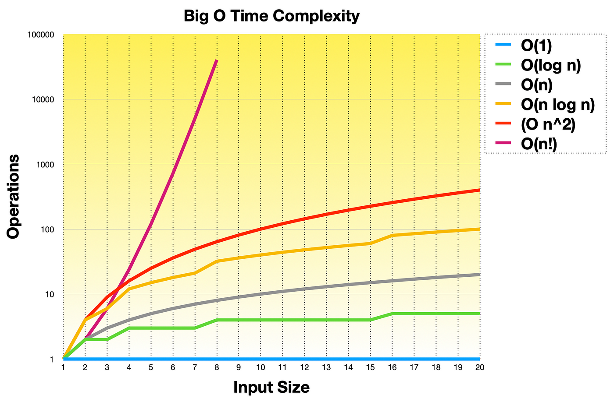

# 🎯 Lecture 0

## Computer Science

Solving problems with ideas and technique. 
Problem solving is a goal achived by computational thinking .
It is a through process.

## how to represent the input for the black box?
> - Unary 
> - base-2 (binary)
>   - bit - binary digit - 0 and 1
> - base-10 (decimal)

Agreed upon representaion of input is byte which is 8 bits.
256 decimal numbers can be represented with 1 byte,

## How to represent the character A in binary
> ##                  01000001

## ASCII - standard for mapping characters as numbers 

Now we can map characters , but it can map only 256 characters as it only uses 1 byte.

## Unicode - it uses 4 bytes
It is created to capture the past , present and future characters in all the languages in the world.
# 😂  U+1F602 
This is a unicode code point. it uses hexadecimal representation. 
U+ is convention for saying that the following numbers are unicode code point. it is a visual clue.

Now the representation of information in covered.

## What is inside the black box ?
> # Algorithm 
> Step by step instructions for solving some problem
> ## Code 
> Implementation in computers of algorithms

"How efficient a algorithm is what we can learn from the big O notation" 

